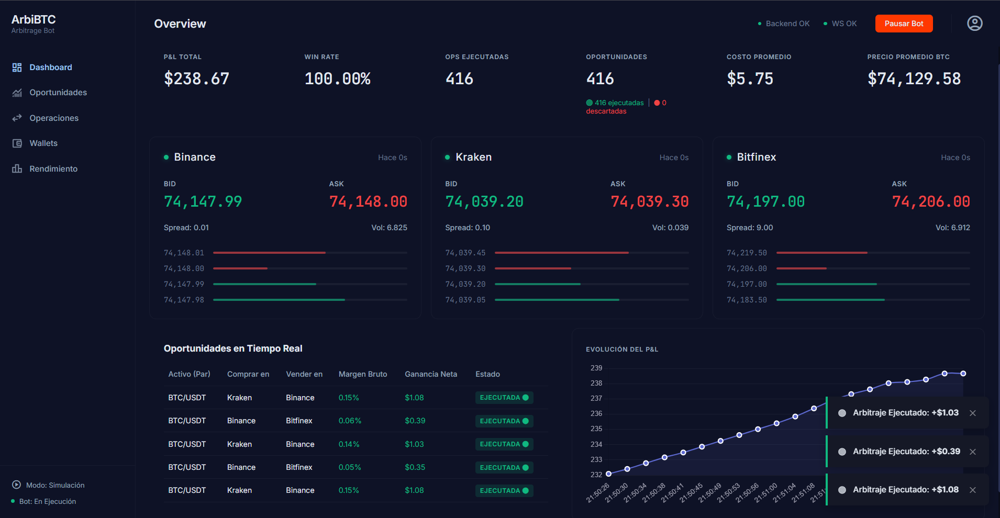
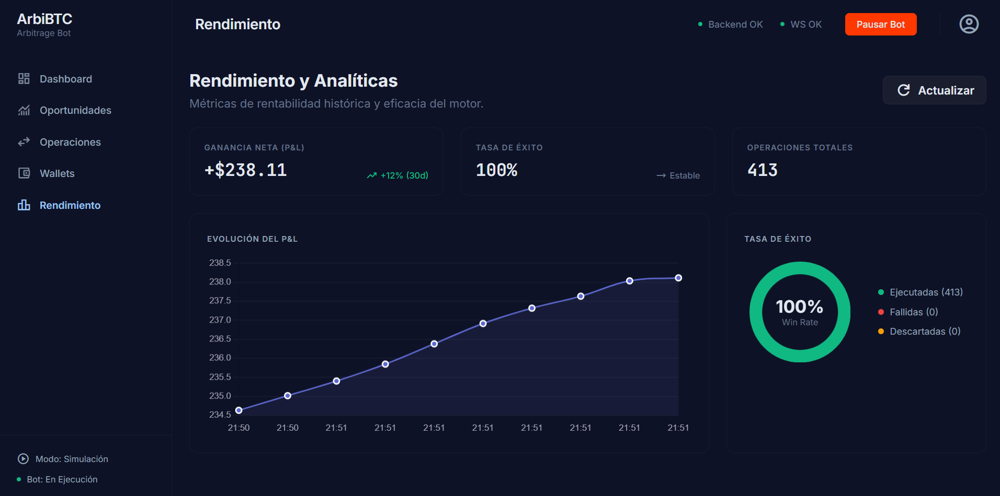
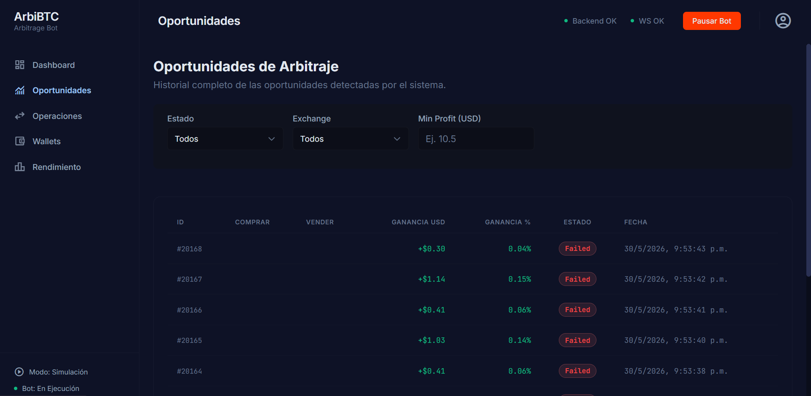
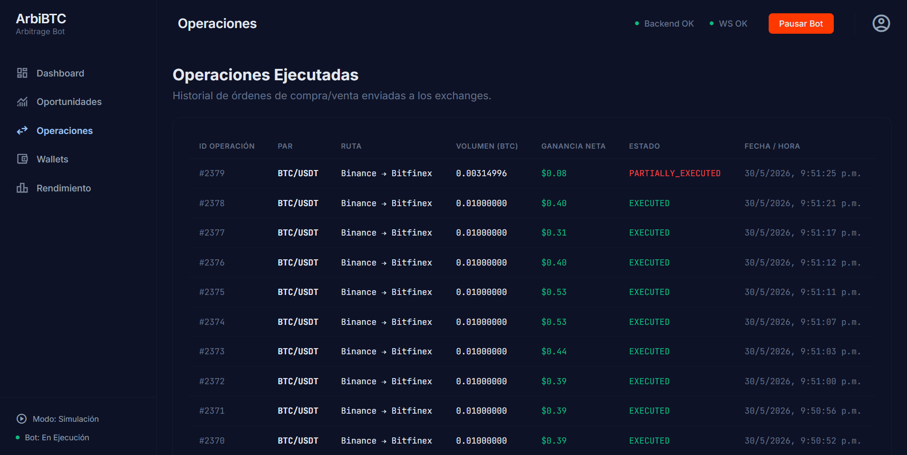
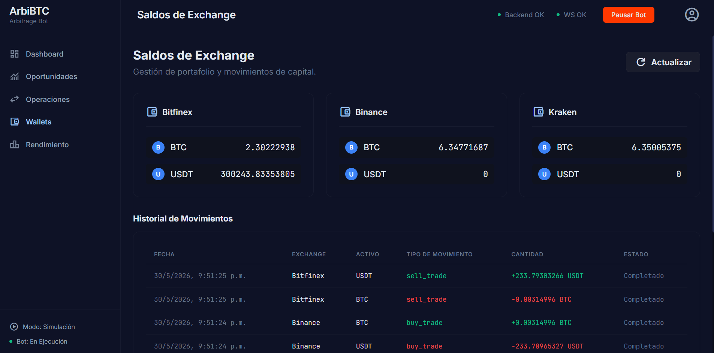

# Motor de Arbitraje HFT

Este proyecto es nuestra solución para el Challenge Final de México. Hemos diseñado una arquitectura de Alta Frecuencia (HFT) enfocada en mitigar los riesgos inherentes al arbitraje cripto en tiempo real, priorizando el rendimiento y la estabilidad.

## Arquitectura del Sistema
El motor está completamente desacoplado para maximizar la velocidad de ejecución:
* **Backend (Rust):** Maneja la lógica matemática, controla WebSockets y enruta órdenes. Es un sistema asíncrono y multi-hilo impulsado por Tokio.
* **Frontend (Vue 3 + Pinia):** Recibe el flujo de datos y lo procesa mediante un canvas reactivo y CSS nativo para evitar la saturación del DOM, logrando visualizaciones fluidas a 60 FPS.
* **Middleware (Redis Pub/Sub):** Actúa como el puente de baja latencia que comunica el backend y el frontend. PostgreSQL se reserva únicamente para auditoría y persistencia asíncrona, evitando cuellos de botella en la lectura de precios.

## Características del Motor

A diferencia de un bot de arbitraje básico, el sistema implementa medidas de seguridad y gestión de riesgo:

### 1. Delta Neutrality (Cobertura de Riesgo Direccional)
Si un exchange se queda sin saldo por un evento de mercado y el inventario neto del bot supera los 2.0 BTC, la exposición direccional al precio de Bitcoin es peligrosa. El bot automáticamente despacha un `DELTA_HEDGE`, emulando la apertura de una posición SHORT en futuros perpetuos para cubrir la cartera de una posible caída de precio mientras rebalancea su saldo.

### 2. Mitigación de Legging Risk
En escenarios reales, una de las dos "patas" del arbitraje puede fallar (latencia, falta de liquidez instantánea). El motor de riesgo en Rust (RiskManager) evalúa y simula constantemente el *Legging Risk*. Si este evento asíncrono ocurre en medio de una operación, el bot ejecuta un *Market Dump* inmediato, sacrificando el margen de ganancia de la operación para liquidar el activo y no quedarse atrapado con el token físico.

### 3. Phantom Liquidity Protection
En libros de órdenes volátiles, el spread a veces es un espejismo creado por un solo market maker (Phantom Liquidity). El motor tiene un cooldown de hardware a nivel de milisegundos para evitar disparar 100 órdenes seguidas hacia una liquidez falsa, asegurando solo trades consolidados.

### 4. Contadores In-Memory (Zero Latency)
Para medir cuántas oportunidades detecta el bot vs. cuántas desecha (por spread negativo), **no hacemos `INSERT` en PostgreSQL** por cada evento, ya que eso destruiría el rendimiento. En su lugar, utilizamos un contador atómico en memoria (`std::sync::atomic::AtomicU64`) dentro del núcleo de Rust. Esto incrementa millones de ticks descartados en 0 milisegundos y los envía al dashboard en tiempo real, demostrando el altísimo throughput del motor.

### 5. Rebalanceo Triangular
Contamos con un Worker Asíncrono de Rebalanceo. Constantemente evalúa si los balances locales (Kraken vs Binance) se desestabilizan de manera crítica, ejecutando transacciones on-chain rápidas (usando un bridge simulado como XRP) para reinyectar capital y seguir tradeando indefinidamente sin intervención humana.

---

## Interfaz de la Plataforma

El sistema cuenta con un panel de control avanzado que permite gestionar y visualizar en tiempo real todas las acciones del motor HFT:

### Dashboard Principal
Monitoreo general, métricas clave y gráfica de velas en tiempo real.


### Configuración del Motor (Settings)
Panel de control táctico donde el usuario puede encender/apagar el bot, ajustar el spread mínimo, volumen dinámico y configurar los fees de Binance y Kraken sin necesidad de reiniciar el servidor.


### Rendimiento y Analíticas
Resumen detallado del P&L (Ganancias y Pérdidas), Win Rate, y métricas de desempeño histórico.


### Oportunidades Detectadas
Libro mayor en tiempo real que refleja las detecciones milisegundo a milisegundo directamente desde el motor de Rust.


### Operaciones Ejecutadas
Historial de operaciones concretadas exitosamente o marcadas como coberturas de emergencia.


### Gestión de Wallets y Movimientos
Supervisión del capital y registro automático de transferencias por Rebalanceos Triangulares o pagos de comisiones.


---

## Tech Stack
- **Rust (Tokio, Axum, SQLx)**
- **Vue 3 (Composition API, Pinia)**
- **PostgreSQL 15**
- **Redis**
- **Docker & Docker Compose**

## Instalación y Uso
Todo el ecosistema está contenerizado y listo para correr localmente o en un servidor:

```bash
# 1. Clonar el repositorio
git clone https://github.com/UzielTzab/coding-challenge-mexico-remake.git
cd coding-challenge-mexico-remake
```

### 2. Configurar variables de entorno
**IMPORTANTE:** Debes crear manualmente un archivo llamado `.env` en la raíz del proyecto y pegar el siguiente contenido dentro de él:

```env
POSTGRES_USER=arbitrage_user
POSTGRES_PASSWORD=arbitrage_password
POSTGRES_DB=arbitrage_db
```

> [!WARNING]
> Si estás en **Windows**, asegúrate de guardar el archivo `.env` con codificación **UTF-8 (sin BOM)**. Si usas Notepad o PowerShell, a veces se guarda en UTF-16, lo que causará un error de caracteres (como `\xff\xfeP...`) al levantar Docker. Alternativamente, puedes simplemente renombrar el archivo `.env.example` que viene en el repositorio a `.env`.

### 3. Instalar y compilar el Frontend (Vue 3)
Dado que el contenedor de Nginx requiere la carpeta compilada `dist`, primero debes construir el frontend localmente:
```bash
cd frontend
npm install
npm run build
cd ..
```
*(Opcional: Si solo quieres probar el frontend localmente sin Nginx, puedes ejecutar `npm run dev` y entrar a `http://localhost:5173`)*

### 4. Levantar servicios (DB, Redis, API en Rust y Frontend en Vue)
En tu terminal (en la raíz del proyecto), ejecuta:
```bash
docker-compose up -d --build
```

Una vez levantado todo el ecosistema con Docker, la plataforma estará disponible y conectada a los WebSockets de mercado en `http://localhost:80` (o el puerto configurado).
